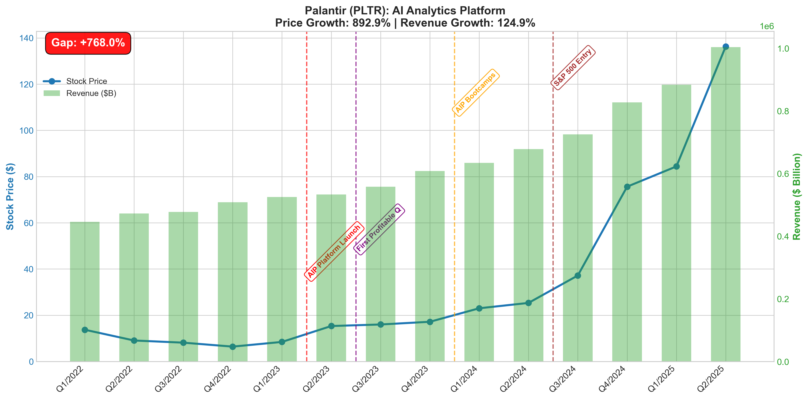
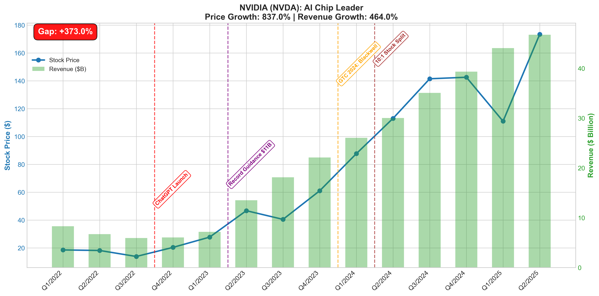
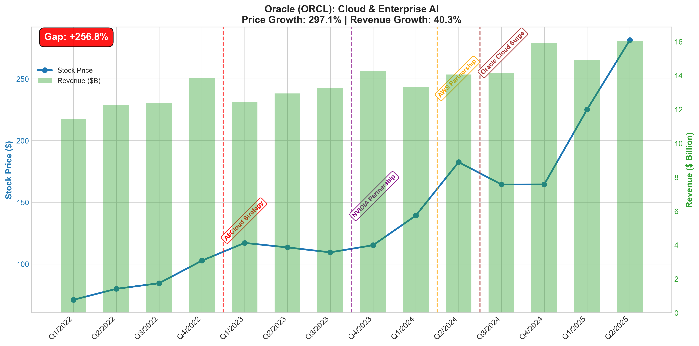
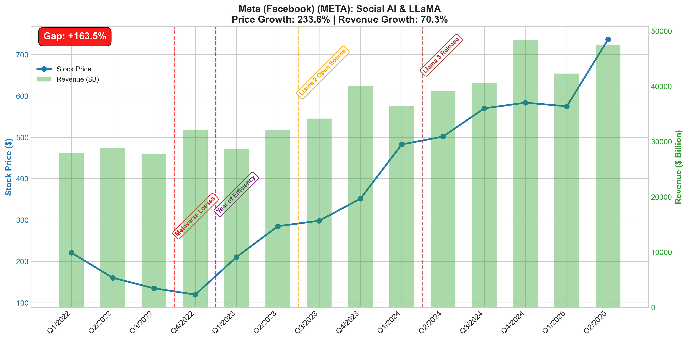
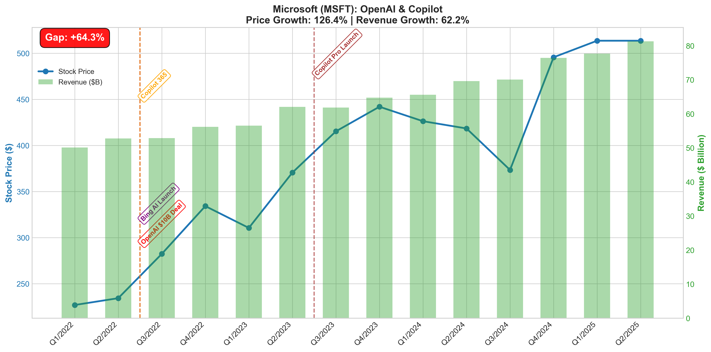
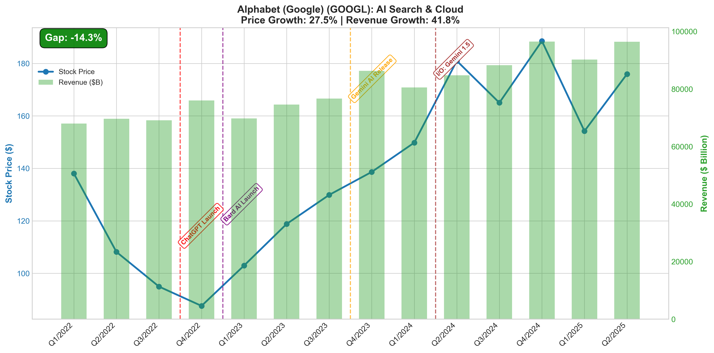
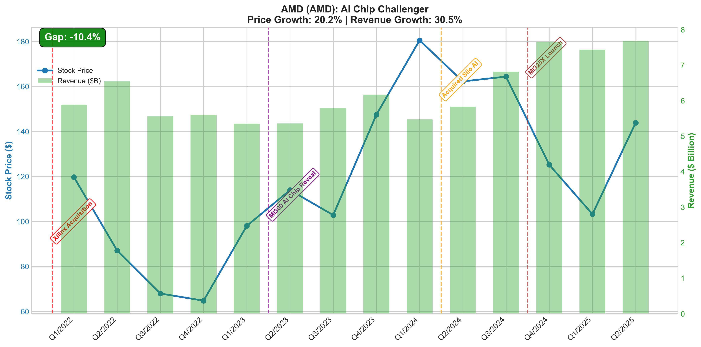
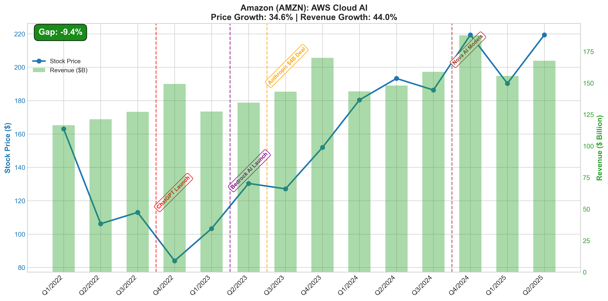
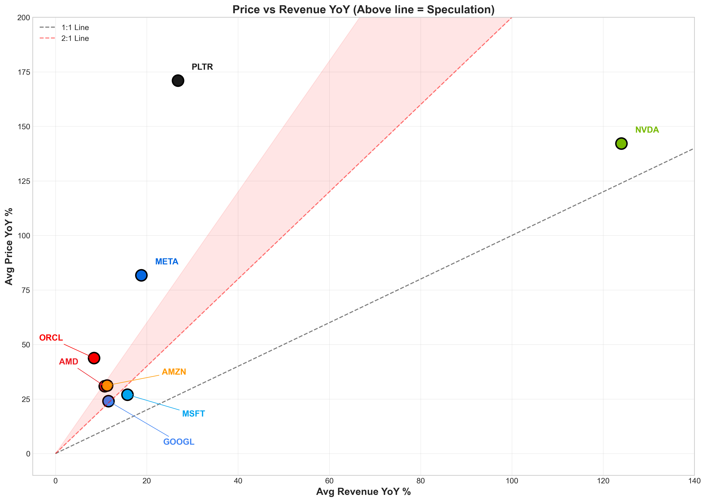

# Will the AI bubble burst or boom? 

    
   >Disclaimer: This analysis is for educational and insight purposes only. It is not investment advice.

### Overview
These three parts a connected study of the current AI equity cycle versus fundamentals and history:

-	[**Part 1**](https://github.com/lynxe585/Will-the-AI-bubble-burst-or-boom/tree/main?tab=readme-ov-file#part-1---ai-bubble-analysis-price-vs-reality-check): Are AI stock prices outrunning their fundamentals (Revenue)?
-	[**Part 2**](https://github.com/lynxe585/Will-the-AI-bubble-burst-or-boom/tree/main?tab=readme-ov-file#part-2---overlay-strategy-dot-com-vs-ai): How does the AI cycle visually compare with the dot-com bubble across key stocks and indices?
-	[**Part 3**](https://github.com/lynxe585/Will-the-AI-bubble-burst-or-boom/tree/main?tab=readme-ov-file#part-3---ai-market-weight--impact-analysis): How big is the AI complex inside the S&P 500, how is broad is the rally, and what if AI crashed?

## An introduction: From the Dot-com Era to the AI Era 

  > **"History doesn't repeat itself, but it often rhymes."** — Mark Twain

In the late 1990s, global markets experienced the Dot-com Bubble. Investors believed “the internet will change the world,” driving a violent rally in technology stocks, especially internet names and infrastructure players such as Cisco, Intel, Qualcomm, and the NASDAQ index. The bubble burst in 2000–2001, triggering a major correction in US equities.

  
Since 2023, markets have entered an AI Boom with a very similar narrative:

-   A “poster child” in NVIDIA (NVDA), the symbol of growth in AI chips and data centers.

-   Big Tech names like  MSFT, GOOGL, META, AMZN have been strongly re‑rated on AI investment.

-   The market is asking: do current prices reflect real revenue/profit potential, or is this a new “AI Bubble” similar to Dot-com?

This project approaches those questions from a perspective along three main axes:

-   Price vs Fundamentals – Are AI stock prices running ahead of revenue?

-   Historical Overlay – How similar or different is the AI cycle versus Dot-com?

-   Systemic Impact – If AI “bursts”, how much pain does it create for the S&P 500?
  
Under this analytical lens, we have identified eight benchmark companies **AMD, AMZN, GOOGL, META, MSFT, NVDA, ORCL, and PLTR** to test the decoupling hypothesis.

## Part 1 - AI Bubble Analysis (Price vs Reality Check)
### Dataset:
-    Yahoo Finance Library - Stock Price
-    Official Website Stock - Stock Revenue 

In the current AI-driven market cycle, the primary imperative for analysis is decoupling exuberant stock price performance from realized revenue growth. As capital flows into AI industry at an unprecedented scale, market valuations have frequently detached from the fundamental capacity of entities to generate earnings.

The report defines the “AI Value Gap” as the quantitative delta between a company’s indexed market valuation (price growth) and its fundamental top-line performance (revenue growth). By isolating this delta, we can distinguish between entities supported by operational scaling and those buoyed by speculative sentiment.

#### **Figure 1**: The AI Bubble Gap - Price Growth vs Revenue Growth 
This series of line charts compares the stock price growth against revenue growth for eight major tech companies (AMD, Amazon, Google, Meta, Microsoft, NVIDIA, Oracle, and Palantir) starting from a baseline in Q1 2022. It visually demonstrates how stock prices are often highly volatile compared to the steadier upward trajectory of actual revenue.

---

#### **Figure 2**: The "AI Bubble Score" Gap (Exact Percentages) The "AI Bubble Score" precisely quantifies the difference between stock price growth and revenue growth since Q1 2022.
Highly Speculative (Red bars): Palantir leads with a massive +768.0% gap, followed by NVIDIA (+373.0%), Oracle (+256.8%), Meta (+163.5%) and Microsoft (+64.3%).
Fundamentally Driven (Green bars): Three companies have seen their revenue outpace their stock price growth indicating strong fundamentals without a speculative premium: Amazon (-9.4%), AMD (-10.4%) and Alphabet/Google (-14.3%).

---

#### Figure3: Individual Company Timelines and Key AI Events by using  Stock Price vs. Revenue Growth.
Each chart overlays quarterly stock price (line) against quarterly revenue (bars) from Q1 2022 through Q2 2025, with key AI milestones annotated. The Gap metric (Price Growth − Revenue Growth) indicates whether the stock is trading on speculation or fundamentals.

##### **Palantir (PLTR)**
**Figure 3.1**: Palantir exhibits extreme speculation with a Gap of +768.0%. Its stock price skyrocketed by an incredible 892.9%, while its actual revenue grew by a much smaller 124.9%. It shows stock price hovering at a relatively low, flat level until mid-2023. The initial upward trend began with its “AIP Platform Launch” and “First Profitable Q”. From there, the stock price went nearly vertical following “AIP Bootcamps” and its “S&P 500 Entry”, completely detaching from the slow, steady growth of its green revenue bars.

##### **Nvidia (NVDA)**
**Figure 3.2**: Nvidia shows a Gap of +373.0%. Its stock experienced explosive 837.0% growth, but unlike Palantir, this is backed by massive 464.0% growth in actual revenue. The chart visually demonstrates the green revenue bars growing aggressively alongside the blue stock price line. The exponential climb began precisely around the “ChatGPT Launch” and accelerated sharply following its “Record Guidance $11B”. Further massive surges in both price and revenue were driven by “GTC 2024:Blackwell” and a “10:1 Stock Split”. 

##### **Oracle (ORCL)**
**Figure 3.3**: Oracle shows a growing disconnect with a Gap of +256.8%. Its stock price grew by 297.1%, which significantly outpaced its revenue growth of 40.3%. The green revenue bars remain relatively flat throughout the timeline. Despite this its stock price climbed steadily, initially spurred by its “AI/Cloud Strategy” and an "NVIDIA Partnership”. The stock experienced another steep surge late in the timeline driven by an “AWS Partnership” and an “Oracle Cloud Surge”, which widened the gap between its market valuation and its actual revenue.

##### **Meta (META)**
**Figure 3.4**: Meta shows a Gap of +163.5%. The stock price grew 233.8% compared to a much more modest revenue growth of 70.3%. The chart is unique because it starts with a severe stock price plunge in late 2022, mapped directly to its “Metaverse Losses”. The stock sharply bottomed out and began a massive, steep recovery during its declared “Year of Efficiency". The stock price continued to surge heavily upward, fueled by AI milestones like the “Llama 2 Open Source” and “Llama 3 Release”, pulling far ahead of its underlying revenue growth.

##### **Microsoft (MSFT)**
**Figure 3.5** Microsoft (MSFT) with Gap +64.3% (Price +126.4% vs. Revenue +62.2%) The only stock in this group with a significant positive gap. Revenue grew steadily (~$50B → ~$80B/quarter), but the stock more than doubled, fueled by the OpenAI partnership, Bing AI, and Copilot rollout. This suggests a substantial speculative premium tied to AI narrative.

##### **Alphbet (GOOGL)**
**Figure 3.6** Alphabet (GOOGL) with Gap −14.3% (Price +27.5% vs. Revenue +41.8%) Revenue outpaced price appreciation despite Bard, Gemini, and Gemini 1.5 launches. Revenue climbed from ~$70B to ~$95B/quarter while the stock recovered more cautiously from 2022 lows  indicating fundamentally supported valuation.

##### **AMD (AMD)**
**Figure 3.7** AMD (AMD) with a Gap 10.4% (Price +20.2% vs. Revenue +30.5%) Revenue grew from ~$5.5B to ~$7.5B/quarter, boosted by MI300/MI325X AI chip launches and the Silo AI acquisition. The stock spiked to ~$180 in early 2024 but pulled back sharply, reflecting market skepticism about competing with NVIDIA despite solid revenue execution.

##### **Amazon (AMZN)**
**Figure 3.8** Amazon (AMZN) with a Gap −9.4% (Price +34.6% vs. Revenue +44.0%) Revenue scaled from ~$120B to ~$175B/quarter, supported by the $4B Anthropic deal, Bedrock AI, and Nova AI Models. Price growth lagged revenue growth, pointing to fundamentally driven appreciation rather than speculation.

---

#### **Figure 4**: Revenue YoY Growth: Only NVDA (Avg 124.0%) consistently exceeds the 50% YoY threshold (red bars), showing its revenue growth truly justifies the price surge.
The rest grow moderately: PLTR (26.8%), META (18.8%), MSFT (15.7%), GOOGL (11.6%), AMZN (11.3%), AMD (10.8%), and ORCL (8.4%).

Notably, ORCL has the weakest revenue growth in the group, Figure 2 shows it carries the 3rd-largest bubble gap (+256.8%) clearly that where speculation far outweighs fundamentals.

---

#### **Figure 5** – Stock Price YoY Growth (Red = >100%, Orange = >50%) 
This chart shows quarterly YoY stock price growth, divided into 3 zones: above 100% (red bars), above 50% (orange bars), and below 50% (green bars). 
Explosive Group (exceeded 100%) 
PLTR (Latest: 438%): The hottest stock right now, exceeding 100% for multiple consecutive quarters, with the latest quarter surging to 438% — the highest in the entire group. 
NVDA (Latest: 54%): Once surpassed 200% during Q2–Q4 2024, but has now slowed to 54%, suggesting its "peak price momentum" may have already passed.
META (Latest: 47%): Spiked to 200% in early 2023, but has gradually declined and now sits below 50%

Once Hot, Now Cooling 
AMD (Latest: −11%): Once surged past 100% in Q1 2024, but has since reversed into negative territory — the most volatile swing in the group. 
ORCL (Latest: 54%):  Inconsistent ups and downs, exceeded 50% several times but never sustained it for long.

Clearly Slowing Down 
MSFT (Latest: 23%): Once nearly reached 60%, now down to 23% and even dipped negative in Q3 2024. 
AMZN (Latest: 14%): Once surged past 80%, now only 14%.
GOOGL (Latest: −3%):Once reached nearly 60% in Q2 2023, but has now turned negative. 
Key Takeaway: Price momentum for most AI stocks is clearly fading except  PLTR which remains abnormally hot, potentially signaling late-stage speculation.

---

#### **Figure 6**: This figure visually demonstrates the “speculation gap” for each company by comparing their year-over-year (YoY) stock price growth directly alongside their YoY revenue growth for every quarter. 

Here is a detailed breakdown of what the chart shows: 
-	For each of the eight tech companies, there is a bar chart showing performance from Q1/2023 to Q2/2025. Red bars represent stock YoY growth, while green bars represent actual revenue YoY growth.
-	Whenever a red bar towers over a green bar, it means the stock price is growing much faster than the actual money the company is making. The chart calculates an “Avg Gap” for each company to summarize this difference.
-	Palantir (PLTR) exhibits the most extreme disconnect, with an Avg Gap of +144%. Its recent red bars (price growth) explode upward – reaching over 400% YoY – while its green bars (revenue growth) remain very small by comparison.
-	Meta also shows high speculation with an Avg Gap of +63%, driven by massive stock price spikes approaching 200% YoY in 2023 and 2024 against much more modest revenue growth.
-	Nvidia (NVDA) is a unique outlier. It has a relatively modest Avg Gap of 18%. This isn’t because its stock price didn’t soar (the red bars are huge), but rather because its actual revenue growth (the green bars) frequently exceeded 150% to 250% YoY, keeping pace with the hype.
-	Microsoft (MSFT) and Alphabet (GOOGL) show the most stability. With the lowest Avg Gaps of +11% and +12% respectively, their red and green bars remain relatively close in height, indicating that their stock prices are growing largely in tandem with their actual revenue.
-	AMD shows an Avg Gap of +20%, but its chart is highly erratic. Its stock price (red bars) swings wildly from negative growth to massive spikes of over 125%, completely detached from its much steadier, smaller revenue growth (green bars)
  
---

#### **Figure 7**: This figure visualize the level of market speculation for each company by plotting their Average Revenue YoY% (horizontal X-axis) against their Average Stock Price YoY% (vertical Y-axis)

Here is a detailed breakdown of what the chart shows: 
-	The chart uses reference lines to establish what healthy, fundamentally backed growth looks like versus speculative hype
-	1:1 Line (Dashed Gray): This represents perfect balance. If a company sits on this line, its stock price is growing at the exact same rate as its actual revenue. 
-	2:1 Line (Dashed Red): This represents a threshold where a company’s stock price is growing twice as fast as its revenue. 
-	Read Shaded Area positioning “Above line = Speculation.” The further a company sits above the 1:1 baseline (and especially the 2:1 line), the more its stock proce is being driven by future expectations and hype rather than current financial performance. 
-	Palantir (PLTR) is the biggest outlier on the chart. It sits extremely high on the Y-axis (averaging roughly 170% price growth) but relatively low on the X-axis (around 25% revenue growth). This places it far above the 2:1 line, indicating massive market speculation. 
-	Meta (META), Oracle (ORCL) and AMD also land distinctly above the 2:1 line, showing that their stock price growth has significantly outpaced their underlying revenue growth
-	Nvidia (NVDA) is positioned uniquely far to the right side of the chart. While its average price growth is incredibly high (around 140%), it is the only company with the massive average revenue growth (over 120%) to back it up. Because it sits relatively close to the 1:1 dashed line, its explosive stock price is largely justified by real business performance rather than just speculation.
-	Microsoft (MSFT), Alphabet (GOOGL) and Amazon (AMZN) are clustered in the lower-left quadrant. They sit closest to the 1:1 baseline, indicating that their moderate stock price gains are closely aligned with their steady revenue growth.

---

#### Figure 8: This figure is a horizontal bar chart that measures the Pearson Correlation (r) between each company's stock price and its actual revenue. It evaluates how closely a stock's market performance is tied to the underlying business fundamentals.

The chart uses a scale where a value closer to 1 indicates a strong correlation (meaning the stock price moves predictably in tandem with revenue), and color-codes the companies into three distinct categories based on these values:

-    Strong Correlation (Green bars, r >= 0.8): The majority of the companies show a strong link between their stock price and revenue. NVIDIA (NVDA) leads the group with the highest correlation of r = 0.960. Its R-squared (R²) value of 0.921 means that a massive 92.1% of its stock price variance can be directly explained by its revenue generation. Palantir (r = 0.947), Microsoft (r = 0.935), Meta (r = 0.916), Oracle (r = 0.835), and Alphabet/Google (r = 0.827) also demonstrate strong fundamental alignment.
-    Moderate Correlation (Orange bar, 0.5 <= r < 0.8): Amazon (AMZN) is the only company in the moderate tier, with a correlation of r = 0.645 and an R² of 0.416.
-    Weak Correlation (Red bar, r < 0.5): AMD is the extreme outlier on this chart, exhibiting a uniquely weak correlation of just r = 0.188. Its incredibly low R² value of 0.035 indicates that a mere 3.5% of its stock price movements are tied to its actual revenue. This highlights that AMD's stock price is highly volatile and currently detached from its fundamental financial performance
  
---

### Summary
1. Extreme Speculation (The "Bubble" Risk) Some companies are seeing their stock prices soar far beyond what their current revenue justifies, signaling a potential bubble.
-    Palantir (PLTR) is the biggest outlier. It has the highest "AI Bubble Score" with a massive 768% gap between its price growth and revenue growth. On average, its year-over-year (YoY) stock price has grown 144% faster than its revenue. It sits deep in the "speculation" zone, meaning its valuation is driven heavily by hype rather than current earnings.
-    Meta (META) and Oracle (ORCL) also show significant signs of speculation. Meta has an average YoY speculation gap of +63%, and Oracle's price growth has outpaced its revenue growth by 256.8% since Q1 2022.

2. Fundamentally Backed Hyper-Growth
-    Nvidia (NVDA) is in a league of its own. While its stock price has grown an astonishing 837% since 2022, this is heavily supported by actual business performance, with revenue growing 464%. It boasts an average YoY revenue growth of 124%—the highest in the group. Furthermore, NVIDIA has the strongest correlation between its stock price and revenue (r = 0.960), meaning its massive market valuation is closely tied to its real-world financial success.
  
3. Balanced and Steady Growth The traditional big tech giants show healthy, balanced growth where stock prices accurately reflect underlying revenue.

-    Microsoft (MSFT), Alphabet/Google (GOOGL), and Amazon (AMZN) all cluster safely near the baseline of fundamentally sound growth.
-    Google and Amazon actually show negative "Bubble Scores" (-14.3% and -9.4% respectively), meaning their revenue has actually grown faster than their stock prices since Q1 2022. Microsoft shows a modest, healthy gap of +11% YoY.

4. Detached Volatility
-    AMD represents a unique case of market disconnect. Its stock price movements are highly erratic and swing wildly. It has the weakest fundamental correlation of the group (r = 0.188), meaning only a minuscule 3.5% of its stock price movement is tied to its actual revenue. This makes AMD a highly volatile stock driven by market sentiment rather than direct financial performance.

---

## Part 2 - Overlay Analysis: Dot-com vs AI
### Dataset:
-    Yahoo Finance Library - Stock Price (Daily Closing Price)

A defining characteristic of speculative market cycles is the recurrence of structural patterns across eras. The Dot-com Bubble (1999–2001) and the current AI-driven rally (2023–2025) share a motivation: a transformative technology attracting capital inflows that inflate valuations beyond near-term fundamental justification.

This report applies an Overlay Analysis — time-aligning 752 trading days of daily closing prices from each era on a normalized index (base = 100)  to enable direct comparison side-by-side  of price trajectories between symbolic companies across both cycles (e.g., Cisco vs Nvidia). By overlapping these curves, we can visually and quantitatively assess whether the current AI rally replicates, exceeds, or or diverges from the patterns observed during the Dot-com Bubble.

## Part 3 - AI Market “Weight & Impact” Analysis

## Conclusion

